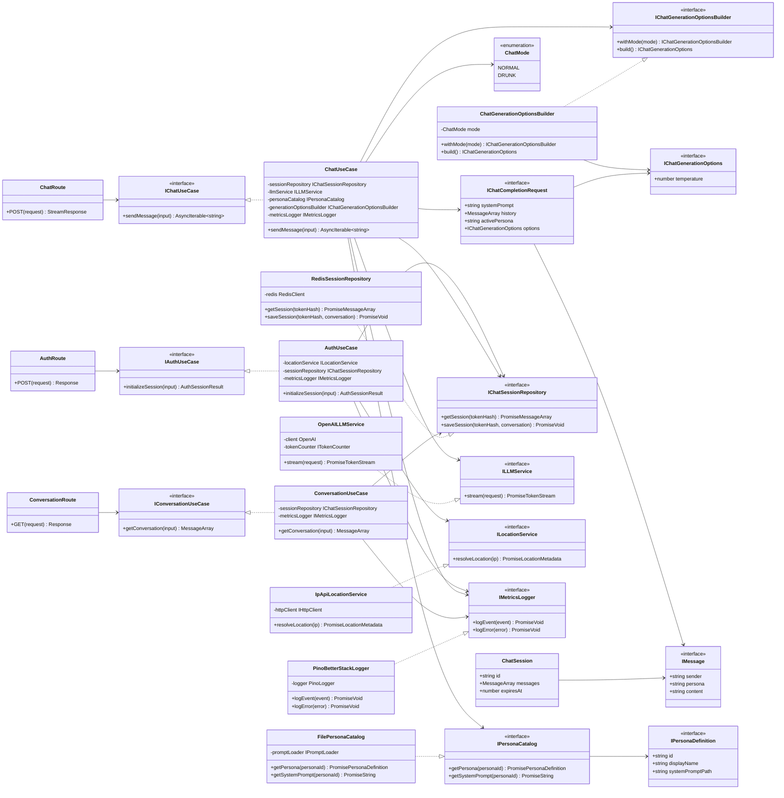
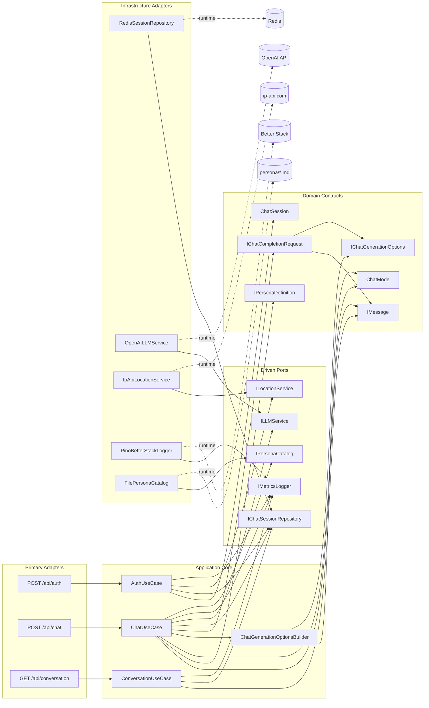
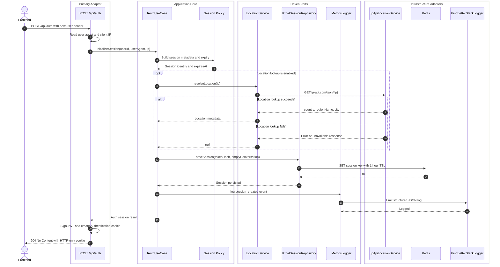
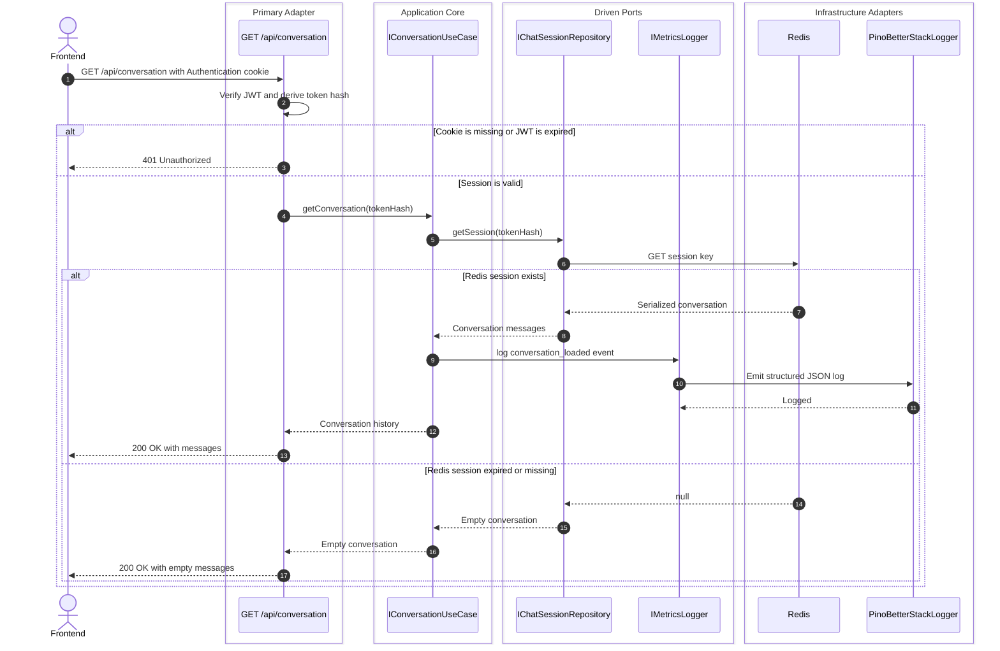
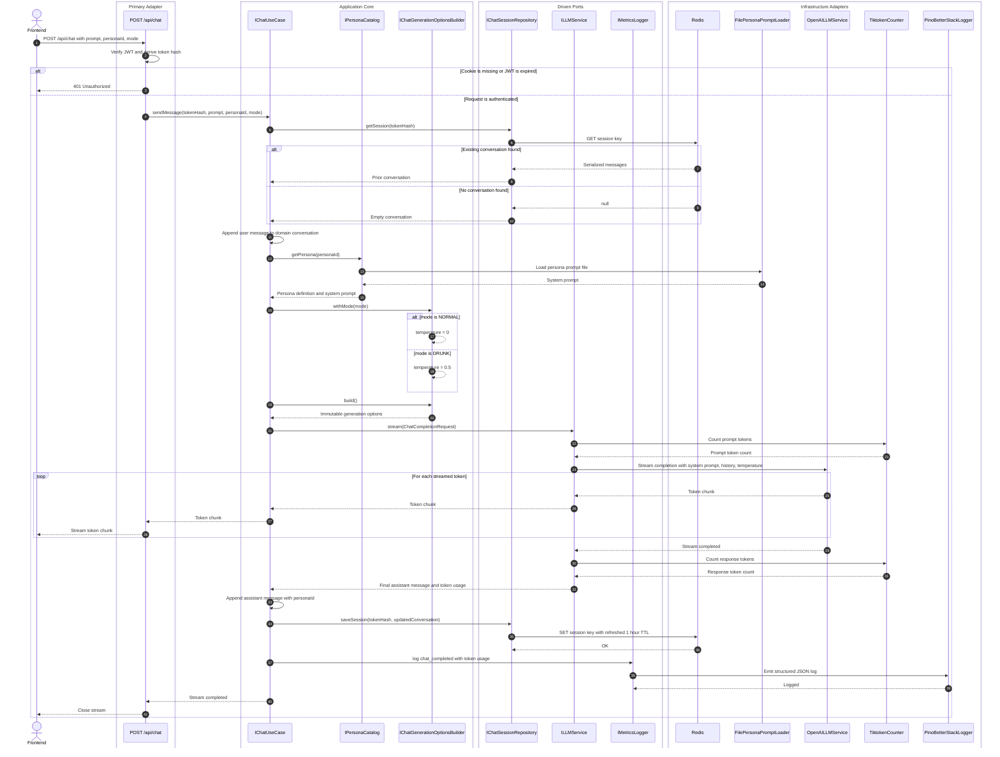
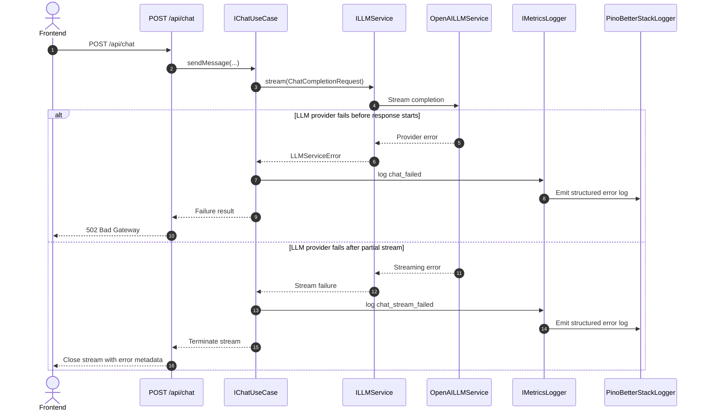
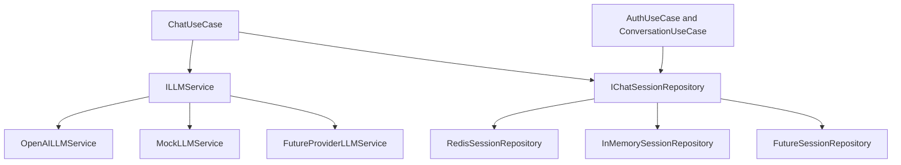

# ChaiChat — Backend Architecture Reference

> **Product Manager's Note (John):** This architecture was validated against the product brief during review. Every interface and use case maps to a real product requirement — session auth secures the single-user experience, persona switching maps to `IPersonaCatalog`, mode selection drives `IChatGenerationOptionsBuilder`. The hexagonal layering means we can swap Redis for SQLite, OpenAI for Anthropic, or Pino for Datadog without touching a single use case. That's the point of this exercise.
>
> **Technical Writer's Note (Paige):** The document that follows combines the class, dependency, and sequence views into a single reference. Each section starts with a diagram, then explains the intent. The Mermaid blocks are ready to render in any Mermaid-compatible viewer.

---

## Contents

1. [Architecture Overview](#1-architecture-overview)
2. [Class Diagram — Structure](#2-class-diagram--structure)
3. [Dependency Diagram — Boundaries](#3-dependency-diagram--boundaries)
4. [Sequence Diagrams — Runtime Flow](#4-sequence-diagrams--runtime-flow)
5. [Boundary Rules](#5-boundary-rules)
6. [Runtime Adapter Replacement](#6-runtime-adapter-replacement)

---

## 1. Architecture Overview

ChaiChat's backend follows **hexagonal (ports and adapters) architecture** with three layers:

| Layer | Responsibility | Examples |
|---|---|---|
| **Primary Adapters** | Translate HTTP input into use-case input | `AuthRoute`, `ChatRoute`, `ConversationRoute` |
| **Application Core** | Owns application flow. Knows ports, not infrastructure. | `AuthUseCase`, `ChatUseCase`, `ConversationUseCase` |
| **Driven Ports** | Define contracts that keep infrastructure replaceable | `IChatSessionRepository`, `ILLMService`, `ILocationService`, `IMetricsLogger`, `IPersonaCatalog` |
| **Infrastructure Adapters** | Implement driven ports against real services | `RedisSessionRepository`, `OpenAILLMService`, `IpApiLocationService`, `PinoBetterStackLogger`, `FilePersonaCatalog` |

**Design principle:** Dependencies point inward. Primary and secondary adapters depend on ports and domain contracts. The core never depends on infrastructure implementations.

---

## 2. Class Diagram — Structure

### Class Responsibilities

| Class / Interface | Role |
|---|---|
| `AuthRoute`, `ChatRoute`, `ConversationRoute` | HTTP adapters — translate requests to use-case input, sign JWTs, manage cookies |
| `IAuthUseCase`, `IChatUseCase`, `IConversationUseCase` | Use-case interfaces — primary adapter boundary |
| `AuthUseCase`, `ChatUseCase`, `ConversationUseCase` | Application logic — orchestrate ports, never touch infrastructure |
| `ChatSession` | Domain aggregate — holds message history and TTL |
| `IMessage` | Domain contract — single message in a conversation |
| `IPersonaDefinition` | Domain contract — persona metadata |
| `ChatMode` | Domain enum — `NORMAL` or `DRUNK` |
| `IChatGenerationOptions` / `IChatGenerationOptionsBuilder` | Builder pattern — keeps LLM output controls extensible |
| `IChatCompletionRequest` | Domain contract — bundles system prompt, history, persona, and options |
| `IChatSessionRepository` | Driven port — session persistence |
| `ILLMService` | Driven port — LLM interaction |
| `ILocationService` | Driven port — IP geolocation |
| `IMetricsLogger` | Driven port — observability |
| `IPersonaCatalog` | Driven port — persona definitions and prompts |
| `RedisSessionRepository`, `OpenAILLMService`, etc. | Infrastructure adapters — implement driven ports |

---

## 3. Dependency Diagram — Boundaries

### Boundary Rules

1. **Routes** depend on use-case interfaces, not infrastructure adapters.
2. **Use cases** depend on ports and domain contracts — never on Redis, OpenAI, Pino, Better Stack, or IP-API.
3. **Infrastructure adapters** implement ports.
4. **Domain contracts** remain stable and storage-agnostic.
5. **Frontend mode selection** maps to domain `ChatMode`; the backend maps `ChatMode` to generation options.
6. **Future LLM controls** extend `IChatGenerationOptions` and `IChatGenerationOptionsBuilder`, not route handlers or use-case flow.

---

## 4. Sequence Diagrams — Runtime Flow

### 4.1 Session Auth Initialization

Runs when the frontend initializes and requests a lightweight session.

**Key flows:**
- Location resolution is optional — failure degrades gracefully to `null`
- Session is persisted with 1-hour TTL
- Response is `204 No Content` with HTTP-only cookie (no body)

---

### 4.2 Conversation History Fetch

Restores retained conversation history on page refresh or chat screen load.

**Key flows:**
- JWT verification gates access — expired or missing cookies return `401`
- Missing/expired Redis sessions return empty conversation (not an error)
- Metrics logged for every successful load

---

### 4.3 Chat Completion Streaming

The core flow: send a prompt, apply persona and mode, stream the LLM response, persist the conversation.

**Key flows:**
- JWT validation gates all requests
- Prior conversation is loaded (or empty if session missing)
- Persona and mode are resolved before the LLM call
- Each token is streamed through the use case → route → browser
- After completion, the full conversation (user + assistant messages) is persisted with refreshed TTL
- Token usage is logged to metrics

---

### 4.4 Chat Error Handling

Failures stay inside adapter boundaries; the core receives explicit typed errors.

**Error handling strategy:**

| Error Scenario | HTTP Response | Logged As |
|---|---|---|
| Missing / expired JWT | `401 Unauthorized` | Route-level (before use case) |
| LLM provider fails before response | `502 Bad Gateway` | `chat_failed` |
| LLM provider fails mid-stream | Stream closed with metadata | `chat_stream_failed` |
| Redis unavailable (session load) | Degrades to empty conversation | `session_load_failed` (logged, not thrown) |
| Redis unavailable (session save) | Stream succeeds, save logged | `session_save_failed` |

---

## 5. Boundary Rules (Summary)

1. **Routes** depend on use-case interfaces only.
2. **Use cases** depend on ports and domain contracts — never on concrete infrastructure.
3. **Infrastructure adapters** implement driven ports. Swapping Redis for SQLite, OpenAI for Anthropic, or Pino for Datadog changes nothing in the core.
4. **Domain contracts** are stable and storage-agnostic. `ChatSession`, `IMessage`, `ChatMode`, etc. have no infrastructure imports.
5. **Frontend mode selection** maps to domain `ChatMode`; the backend translates `ChatMode` to `IChatGenerationOptions` via the builder.
6. **New LLM controls** extend `IChatGenerationOptions` and `IChatGenerationOptionsBuilder` — no route or use-case changes needed.

---

## 6. Runtime Adapter Replacement

Every driven port can be replaced at runtime by injecting a different implementation:

**Current infrastructure choices:**

| Port | Implementation | Production Ready |
|---|---|---|
| `IChatSessionRepository` | `RedisSessionRepository` | Yes |
| `ILLMService` | `OpenAILLMService` | Yes |
| `ILocationService` | `IpApiLocationService` | Yes |
| `IMetricsLogger` | `PinoBetterStackLogger` | Yes |
| `IPersonaCatalog` | `FilePersonaCatalog` | Yes |

---

## Architecture Decisions

| Decision | Rationale |
|---|---|
| **Hexagonal architecture** | Clean separation lets us swap infrastructure without touching use cases. Proves SOLID compliance. |
| **Streaming via `AsyncIterable`** | Use case returns a token stream; route adapter chooses how to deliver it (SSE, WebSocket, etc.). |
| **Builder pattern for generation options** | Adding `maxTokens`, `topP`, or future parameters extends the builder, not the use case signature. |
| **JWT for session tokens** | Stateless, HTTP-only cookie fits the single-user-scope. No session DB needed. |
| **1-hour TTL** | Matches realistic chat session duration. Refreshed on each interaction. |
| **Location as optional** | Degrades gracefully. Feature flag in the use case, not a hard dependency. |

---

*Generated from `class.md`, `dependency.md`, and `sequence.md` — reviewed and approved.*
